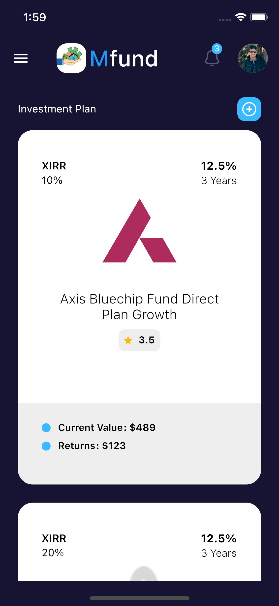
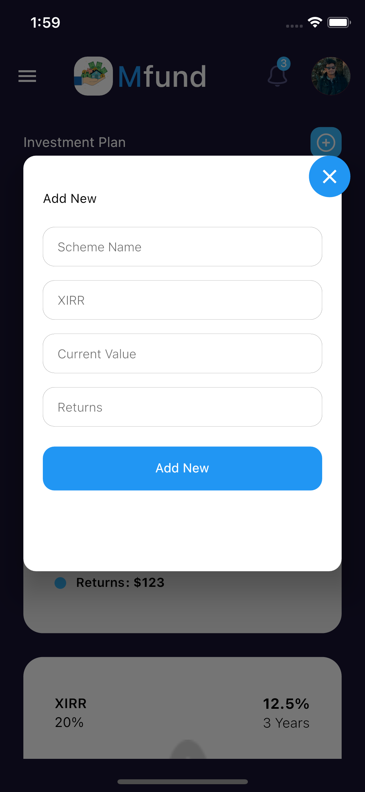

# Investment Plan Screen

## **Investment Plan  :**

* Investment Plan Screen depicts all the details of the organisations , this screen also contains a dialog box through which an admin can add other organisations. The details are fetched through GET API request and when the admin fills the dialog box, the data is stored in the backend through POST request.

