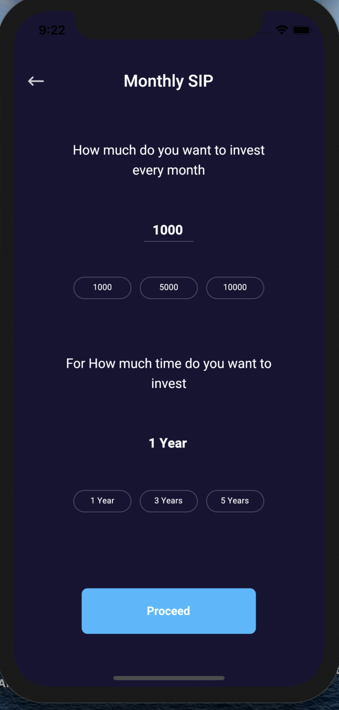
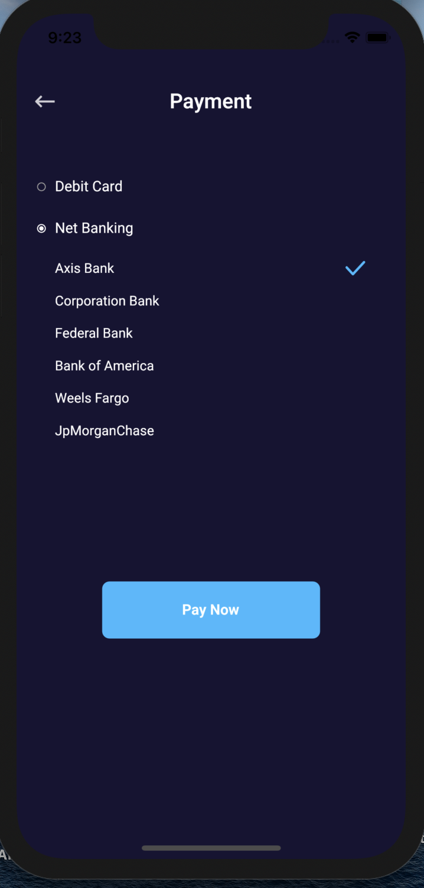

# Investment Screen

## Investment

* This screen will depict the plans, user has invested in.

## Monthly SIP

* Here, a user can invest an amount monthly for a certain period of time\(1 year, 3 years, 5years\).

## One Time SIP

## Payment

* After investing a certain amount, user can pay via either his/her debit card or net banking.

