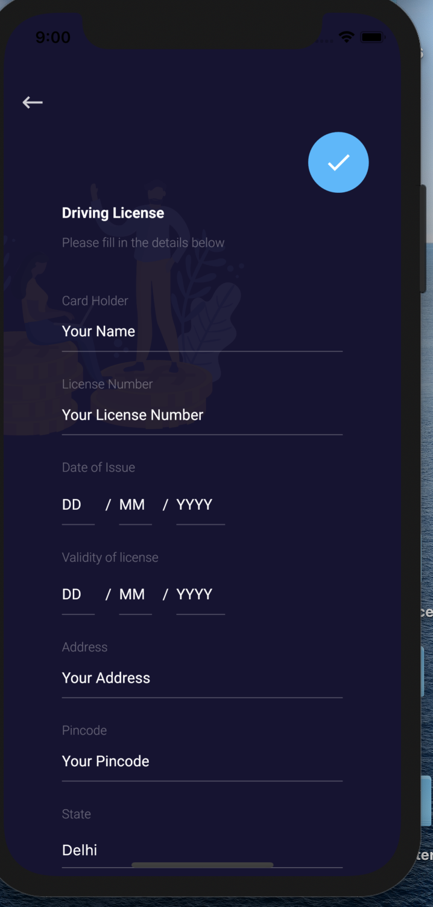
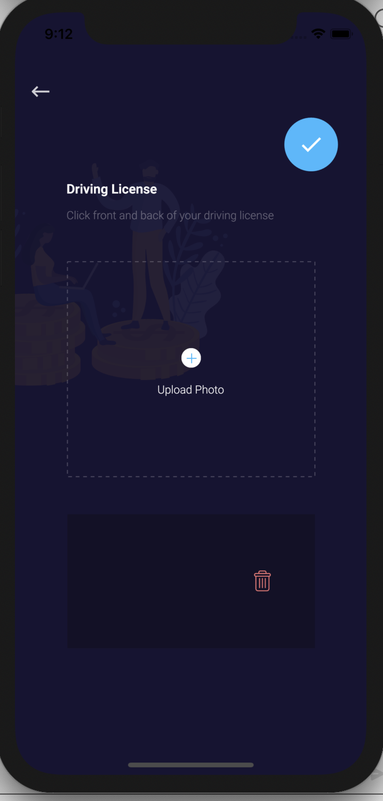
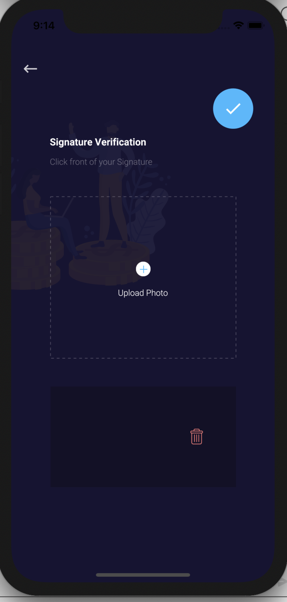

# KYC Screen

## KYC

* The user needs to provide all of his/her details which are required for the KYC verification process for instance his/her PAN number, bank account details, driving license details, since then only he/she can invest in funds.

