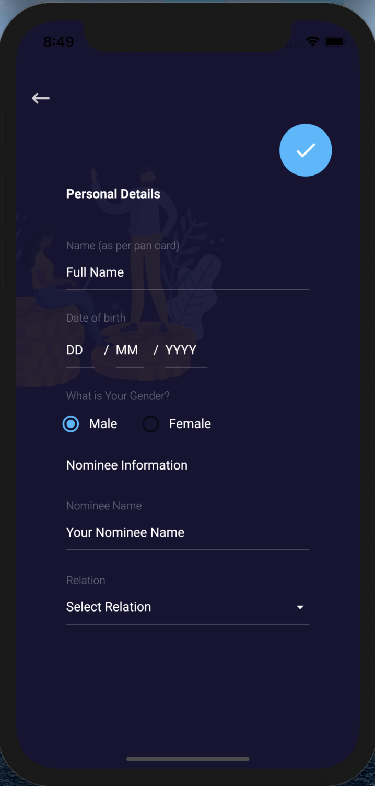

# Signup Screen

## Signup

* The user needs to provide his/her phone number which would be authenticated by sending an OTP to the user via firebase authentication methods. After the OTP verification, user needs to enter his/her personal details.

